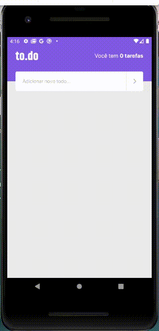

<h1 align="center">Ignite(React-Native) - Desafio 01</h1>

<h2 align="center">🚀 Este desafio é parte do Capítulo I do Ignite da Rocketseat, ele tem como objetivo treinar o que foi aprendido sobre React-native. </h2>

Essa é uma aplicação de lembrete de tarefas. As funcionalidades do aplicativo são: 

<ul>
    <li>Contagem de tarefas;</li>
    <li>Adicionar uma nova tarefa;</li>
    <li>Remover uma tarefa;</li>
    <li>Marcar e desmarcar uma tarefa como concluída.</li>
</ul>

<h4 align="center"> 
	🚧  React-Native Fundamentos 🚀 Concluído!  🚧
</h4>

<h1 align="center">
  
</h1>

### 🛠 Tecnologias

As seguintes ferramentas foram usadas na construção do projeto:

- [React](https://pt-br.reactjs.org/)
- [React Native](https://reactnative.dev/)
- [TypeScript](https://www.typescriptlang.org/)
